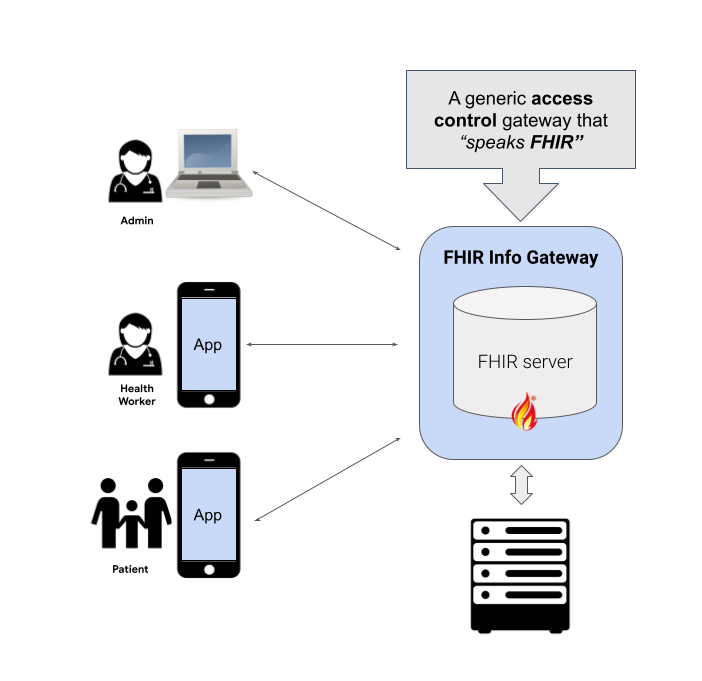

# FHIR Info Gateway
The Info Gateway is a reverse proxy which controls client access to FHIR resources on a server by checking requests for authorization to a FHIR URL or search query. 

It makes it easier for developers to enforce organizational role based access control (RBAC) policies when working with FHIR data.

* The Info Gateway enables authorization (AT) and access-control (ACL) between a client application and a FHIR server when used along with any OpenID Connect compliant Identity Provider (IdP) and Authorization server (AuthZ). 
* It currently supports Keycloak as the IDP+AuthZ provider and has been tested with HAPI FHIR and Google Cloud Healthcare API FHIR store as the FHIR server.

## Key Features
Key features of the Info Gateway features include:

* A stand-alone service that can work with any FHIR compliant servers (e.g., a HAPI FHIR server, GCP FHIR store, etc.)
* A pluggable architecture for defining an access-checkers to allow for implementation configurability
* Query filtering to block/allow specific queries such as for disabling joins

## Common use cases
The Info Gateway is designed to solve for a generic problem, that is, access control for **any client**. 

Common use cases include:

1. Web based dashboard used by program admins

2. For a mobile app used by commnunity based frontline health workers possibly with offline support

3. For a personal health record app used by patients or care-givers

4. To enable SMART-on-FHIR for patient or system level scopes

